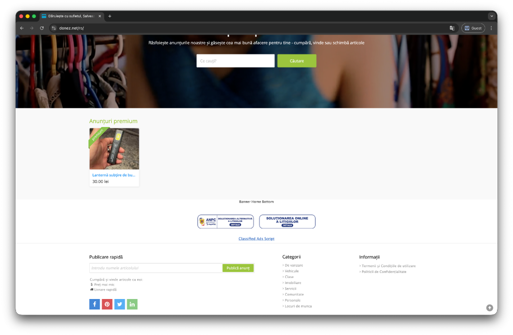

# 🎉 ANPC Display v1.0.0 - First Official Release

## Overview

First official release of **ANPC Display** - a comprehensive Osclass plugin for displaying mandatory SAL and SOL compliance links required by Romanian law (ANPC Order no. 449/2022).

---

## 🚀 What's New

### Core Features

- ✅ **Automatic Display** - SAL and SOL icons appear automatically in footer or header
- ✅ **Local Assets** - All images stored locally (GDPR compliant, no external requests)
- ✅ **Plug & Play** - Works immediately after activation with sensible defaults

### Advanced Customization

- 🎯 **Display Position** - Choose between footer or header placement
- 📏 **Icon Sizing** - Three presets: Small (150px), Medium (250px), Large (350px)
- 🎨 **Custom CSS** - Add your own styling without editing plugin files
- 🔗 **Link Control** - Configure URLs and new tab behavior
- 👁️ **Live Preview** - See how icons will look before saving

### Modern Admin Panel

- 🖥️ **Redesigned UI** - Clean, modern interface with organized sections
- 📝 **Help Text** - Contextual help for every setting
- 🎨 **Visual Feedback** - Color-coded sections and clear labels
- 📚 **Built-in Documentation** - Quick reference and legal information

### Technical Excellence

- 🔒 **Security** - Sanitized inputs, secure external links
- 📱 **Responsive** - Optimized for all screen sizes
- ⚡ **Performance** - Lightweight with minimal overhead
- 🌍 **Standards Compliant** - Follows Osclass best practices

---

## 📸 Screenshot

### Live Example



_The plugin automatically displays SAL and SOL compliance icons in your site's footer, as shown in this live Osclass installation._

---

## 📦 Installation

### Quick Install

1. **Download** `anpc_display.zip` from this release
2. **Upload** via Osclass admin: Plugins → Add Plugin → Upload
3. **Install** and activate the plugin
4. **Configure** from the ANPC Display menu

### Manual Install

```bash
# Extract to your Osclass plugins directory
unzip anpc_display.zip -d /path/to/osclass/oc-content/plugins/
```

---

## ⚙️ Configuration Options

| Setting          | Options                | Default                            |
| ---------------- | ---------------------- | ---------------------------------- |
| Enable Plugin    | On/Off                 | On                                 |
| Display Position | Footer / Header        | Footer                             |
| Icon Size        | Small / Medium / Large | Medium                             |
| Open in New Tab  | Yes / No               | Yes                                |
| SAL URL          | Custom URL             | https://anpc.ro/ce-este-sal/       |
| SOL URL          | Custom URL             | https://ec.europa.eu/consumers/odr |
| Custom CSS       | CSS Code               | (empty)                            |

---

## 🎨 Customization Examples

### Change Icon Background

```css
.anpc-item img {
  background: white;
  padding: 10px;
  border-radius: 8px;
  box-shadow: 0 2px 4px rgba(0, 0, 0, 0.1);
}
```

### Center Align Icons

```css
.anpc-display-container {
  justify-content: center;
}
```

### Add Border to Container

```css
.anpc-display-container {
  border-top: 2px solid #0073aa;
  border-bottom: 2px solid #0073aa;
}
```

---

## 📋 Requirements

- **Osclass**: 3.0+ (tested up to 8.2.0)
- **PHP**: 5.6+ (recommended: 7.4+)
- **Themes**: Compatible with all standard Osclass themes
- **Browsers**: Chrome, Firefox, Safari, Edge (modern versions)

---

## 🔒 Legal Compliance

This plugin ensures compliance with:

- ✅ **ANPC Order no. 449/2022** (Romanian consumer protection)
- ✅ **GDPR** (all assets local, no tracking)
- ✅ **EU ODR Regulation** (Online Dispute Resolution)

### What This Means

All online stores in Romania **must display**:

1. **SAL** - Alternative Dispute Resolution link
2. **SOL** - Online Dispute Resolution link

This plugin handles this requirement automatically.

---

## 📚 Documentation

- **[Complete Documentation](DOCUMENTATION.md)** - Full guide with troubleshooting
- **[Changelog](CHANGELOG.md)** - Detailed version history
- **[README](README.md)** - Quick start guide (bilingual)

---

## 🐛 Known Issues

No known issues in this release.

To report bugs: [Open an Issue](https://github.com/costel21d/osclass-anpc-display/issues)

---

## 🔄 Upgrade Notes

This is the first release - no upgrade path needed.

---

## 📊 What's Included

```
anpc_display/
├── index.php          # Main plugin file
├── admin.php          # Admin settings panel
├── README.txt         # Plugin information
└── assets/
    ├── sal.png        # SAL icon (250x50px)
    └── sol.png        # SOL icon (250x50px)
```

---

## 🤝 Contributing

Contributions welcome! Please:

1. Fork the repository
2. Create a feature branch
3. Submit a pull request

---

## 📄 License

**MIT License** - Free to use, modify, and distribute.

See [LICENSE](LICENSE) for full details.

---

## 👨‍💻 Author

**Constantin Onu**

- 🌐 Website: [onu.ro](https://www.onu.ro)
- 💼 GitHub: [@costel21d](https://github.com/costel21d)
- 📧 Email: costel21d@yahoo.com

---

## ⭐ Support This Project

If you find this plugin useful:

- ⭐ Star this repository
- 🐛 Report bugs or suggest features
- 🔄 Share with others who need ANPC compliance
- 💬 Leave feedback

---

## 🙏 Acknowledgments

Thanks to:

- Osclass community for the excellent platform
- ANPC for clear compliance guidelines
- All users and contributors

---

**Release Date:** January 19, 2026  
**Version:** 1.0.0  
**Download:** [anpc_display.zip](https://github.com/costel21d/osclass-anpc-display/releases/download/v1.0.0/anpc_display.zip)

---

**🇷🇴 Pentru utilizatori români:** Acest plugin vă ajută să respectați automat cerințele ANPC privind afișarea linkurilor SAL și SOL. Instalare simplă, configurare intuitivă, conformitate garantată.
